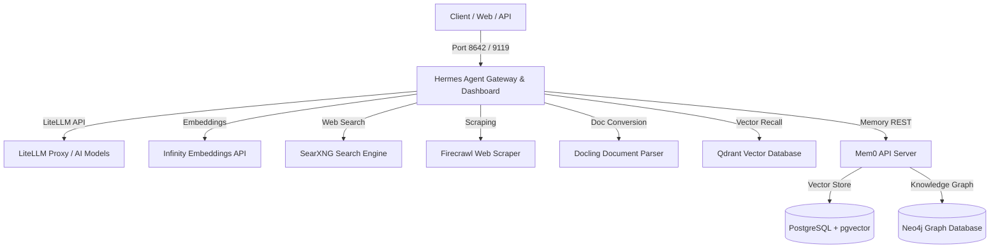

# 🤖 Homelab AI Agents Stack

A containerized agentic runtime and long-term conversational memory stack powered by **Nous Research Hermes Agent** and **Mem0** (PostgreSQL + pgvector + Neo4j Graph).

Optimized for **ARM64 (Orange Pi 5 Plus 32GB RAM)** and generic Linux/Docker environments.

---

## 🏛️ Architecture Overview



---

## 🚀 Quick Start

### 1. Clone & Configure Environment
```bash
cp .env.example .env
nano .env
```
Generate strong random keys and configure your LiteLLM proxy address:
```bash
openssl rand -hex 16
```

### 2. Deploy the Stack
```bash
docker compose up -d
```
The `init-volumes` container will automatically initialize the host directory structure and set proper UID/GID permissions for PostgreSQL (`999:999`) and Neo4j (`7474:7474`).

---

## ⚙️ Hardware & Performance Tuning (32GB RAM Node)

- **PostgreSQL (`pgvector`):** Shared memory (`shm_size`) is set to `512mb` to allow fast vector similarity searches over millions of memory vectors.
- **Neo4j Graph Database:** Initial heap is allocated to `1GB`, max heap to `2GB`, and page cache to `1GB` for high-throughput entity extraction and graph relationship queries.
- **Log Rotation:** All services have JSON log rotation enabled (`10m`, max 3 files) to prevent micro-SD / NVMe storage exhaustion.

---

## 🔒 Security Best Practices

- Ensure `.env` is **never** committed to version control (`.gitignore` protects this by default).
- The `shared_net` Docker network attaches to your reverse proxy (Caddy / Traefik / Dockhand) with `external: true`.
- Change default passwords for `MEM0_PG_PASSWORD`, `NEO4J_PASSWORD`, and `HERMES_DASHBOARD_BASIC_AUTH_PASSWORD`.
